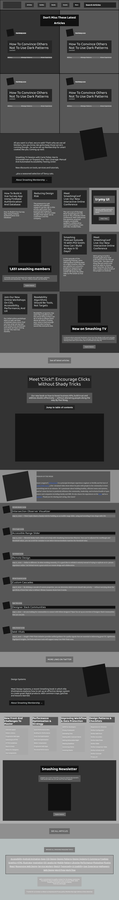

# Smashing Magazine Homepage Heatmap

This is a heatmap of the homepage of [the smashing magazine website](https://www.smashingmagazine.com/)

## Built With

- HTML, CSS

## Live Demo

[Live Demo Link](https://marilenaroque.github.io/HeatMapSmashingMagazine/)

## Getting Started

To get a local copy up and running follow these simple example steps.

### Usage
- Just open the `index.html` file

## Authors

👤 **WinterCore**

- Github: [@WinterCore](https://github.com/WinterCore)

👤 **Marilena Roque**
- Github: [@MarilenaRoque](https://github.com/MarilenaRoque)
- Twitter: [@MariRoq88285995](https://twitter.com/MariRoq88285995)
- Linkedin: [roquemarilena](https://www.linkedin.com/in/roquemarilena/)

## 🤝 Contributing

Contributions, issues and feature requests are welcome!

Feel free to check the [issues page](issues/).

## Show your support

Give a ⭐️ if you like this project!

## Acknowledgments

- Hat tip to anyone whose code was used
- Inspiration
- etc

## 📝 License

This project is [MIT](lic.url) licensed.